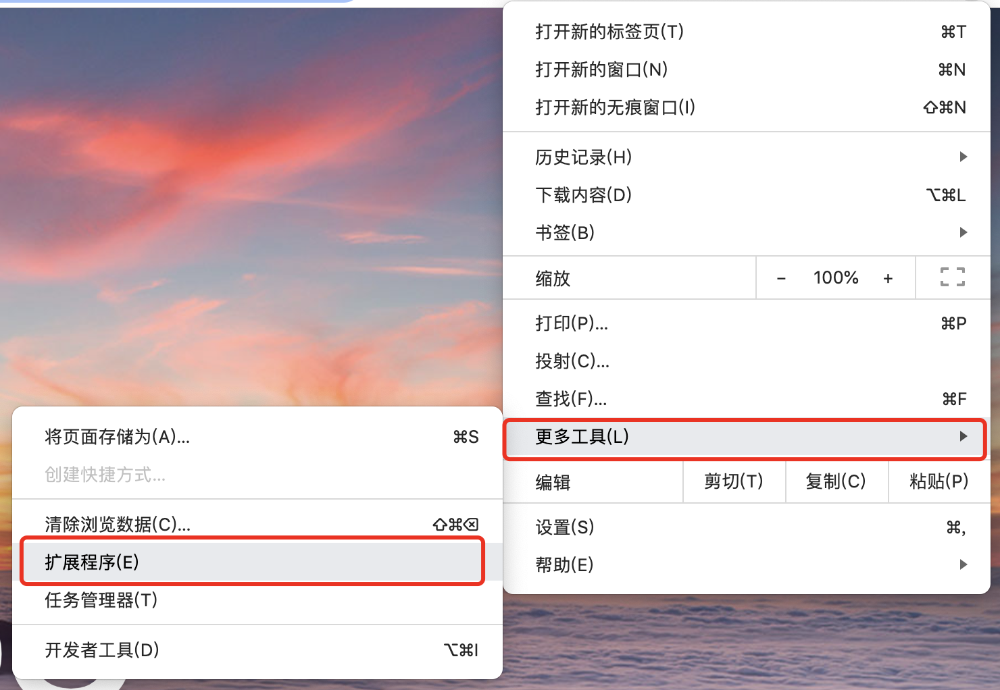
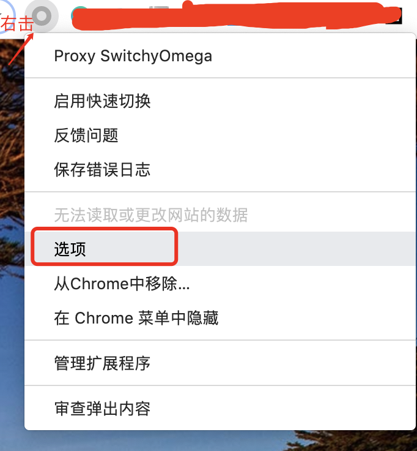
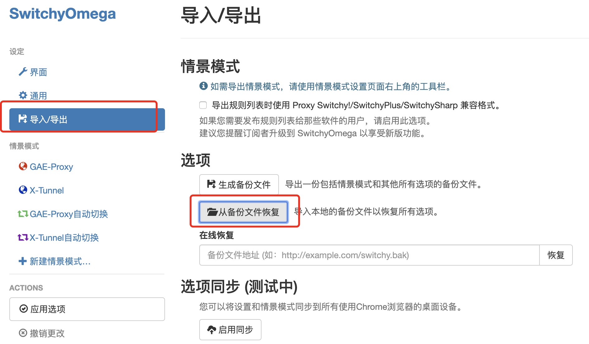
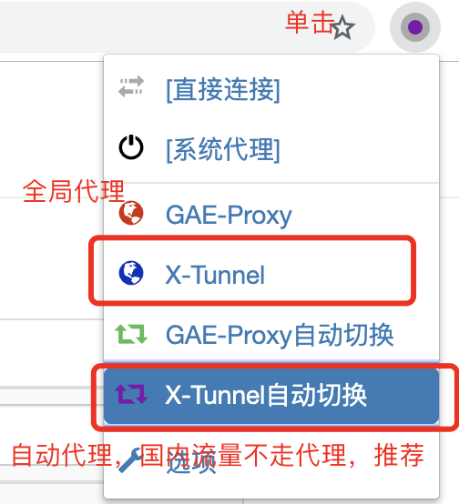

# SwitchyOmega
> 详细说明：[http://jiyiren.github.io/2016/10/06/fanqiang/](http://jiyiren.github.io/2016/10/06/fanqiang/)

## 文件

* **SwitchyOmega.crx**：Chrom 代理插件，可以拖动到Chrom浏览器插件处安装

* **OmegaOptions.bak**：插件安装后的代理配置选项的备份文件，可以在插件设置里选择恢复备份，选择此文件则会自动配置好代理。

## 步骤

* 安装插件，打开 Chrom 浏览器菜单栏，更多工具，扩展程序，将插件 **SwitchyOmega.crx** 拖入。

	

* 开启插件，这样在浏览器地址栏右侧就可以看到圆形的图标了。

	

* 右击那个图标，选择选项，然后选择导入导出，从备份导入 **OmegaOptions.bak** 这个备份文件。
	
	
	
	

* 导入完后就多了四个菜单，然后还是点击浏览器地址栏右侧图标，是单击，然后选择 **X-Tunnel** 或者 **X-Tunnel 自动切换**，推荐后者。

	